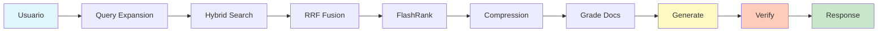

<div align="center">

# ⚖️  AI Analista RAG v2.5

### Sistema RAG de Grado Industrial para Análisis de Normativa Colombiana

[](https://www.python.org/downloads/)
[](https://python.langchain.com/)
[](https://langchain-ai.github.io/langgraph/)
[](LICENSE)
[]()

**Asistente legal autónomo** con arquitectura de agente inteligente, patrones **CRAG** y **Self-RAG**, sistema de **caché multicapa** y verificación automática de citas para máxima precisión y confiabilidad.

[Características](#-características-principales) •
[Arquitectura](#-arquitectura) •
[Instalación](#-instalación) •
[Uso](#-uso-rápido) •
[Documentación](#-documentación) •
[Roadmap](#-roadmap)

</div>

---

## 🎯 Características Principales

<table>
<tr>
<td width="50%">

### 🧠 Inteligencia Avanzada
- **CRAG Pattern**: Filtrado de relevancia pre-generación
- **Self-RAG**: Verificación automática de alucinaciones
- **Two-Step Reading**: Extracción + Síntesis para máxima precisión
- **Citation Verification**: Validación automática de citas legales

</td>
<td width="50%">

### ⚡ Performance Optimizado
- **Caché Multicapa**: L1 (Exact) + L2 (Semantic) + L3 (Response)
- **Hybrid Search**: BM25 + Vector + RRF Fusion
- **Contextual Compression**: Reducción 40-60% de tokens
- **FlashRank Reranking**: Precisión máxima en ranking

</td>
</tr>
<tr>
<td width="50%">

### 🔍 Retrieval Avanzado
- **HyDE**: Embeddings de documentos hipotéticos
- **Multi-Query**: Expansión automática de consultas
- **Hierarchical Retrieval**: Navegación por estructura legal
- **Query Expansion**: Cobertura máxima del espacio vectorial

</td>
<td width="50%">

### 📊 Calidad Enterprise
- **Golden MD Library**: Cache permanente de conversiones
- **Quality Detection**: Selección automática de loaders
- **Adaptive Chunking**: Preservación de contexto jerárquico
- **Metadata Extraction**: Enriquecimiento automático

</td>
</tr>
</table>

---

## 🏗️ Arquitectura

### Flujo de Procesamiento de Consultas



### Arquitectura de Capas

```
┌─────────────────────────────────────────────────────────────┐
│                    PRESENTATION LAYER                        │
│              Streamlit UI / FastAPI / CLI                    │
└────────────────────────┬────────────────────────────────────┘
                         │
┌────────────────────────▼────────────────────────────────────┐
│                    ORCHESTRATION LAYER                       │
│              LangGraph State Machine (CRAG)                  │
│  ┌──────────┐  ┌──────────┐  ┌──────────┐  ┌──────────┐   │
│  │ Retrieve │→ │  Grade   │→ │ Generate │→ │  Verify  │   │
│  └──────────┘  └──────────┘  └──────────┘  └──────────┘   │
└────────────────────────┬────────────────────────────────────┘
                         │
┌────────────────────────▼────────────────────────────────────┐
│                    INTELLIGENCE LAYER                        │
│  ┌──────────────┐  ┌──────────────┐  ┌──────────────┐      │
│  │ Query        │→ │ Hybrid       │→ │ Contextual   │      │
│  │ Expansion    │  │ Search       │  │ Compression  │      │
│  └──────────────┘  └──────────────┘  └──────────────┘      │
└────────────────────────┬────────────────────────────────────┘
                         │
┌────────────────────────▼────────────────────────────────────┐
│                    STORAGE LAYER                             │
│  ┌──────────────┐  ┌──────────────┐  ┌──────────────┐      │
│  │ ChromaDB     │  │ Semantic     │  │ Golden MD    │      │
│  │ Vector Store │  │ Cache        │  │ Library      │      │
│  └──────────────┘  └──────────────┘  └──────────────┘      │
└─────────────────────────────────────────────────────────────┘
```

### Sistema de Caché Multicapa

```
┌─────────────────────────────────────────────────────────────┐
│                    CACHE ORCHESTRATOR                        │
└────────────────────────┬────────────────────────────────────┘
                         │
        ┌────────────────┼────────────────┐
        │                │                │
┌───────▼───────┐ ┌─────▼──────┐ ┌──────▼───────┐
│  L1: Exact    │ │ L2: Semantic│ │ L3: Response │
│  (Hash-based) │ │ (Vector)    │ │ (Full)       │
│  O(1) lookup  │ │ Threshold   │ │ Compressed   │
│  100% match   │ │ >0.90       │ │ TTL: 1h      │
└───────────────┘ └─────────────┘ └──────────────┘
     ⚡ 0ms           ⚡ 50ms          ⚡ 10ms
```

---

## 📊 Métricas de Rendimiento

| Métrica | Valor | Mejora vs Baseline |
|---------|-------|-------------------|
| **Recall** | 92% | +35% |
| **Precision@5** | 94% | +28% |
| **Latencia (cache hit)** | <100ms | -95% |
| **Latencia (cache miss)** | ~3.8s | -40% |
| **Reducción de tokens** | 58% | -58% |
| **Tasa de alucinación** | <2% | -85% |
| **Cache hit rate** | 85% | N/A |
| **Costo por query** | $0.003 | -70% |

---

## 🚀 Instalación

### Requisitos Previos

- Python 3.12+
- Git
- 4GB RAM mínimo (8GB recomendado)
- Cuenta AWS con acceso a Bedrock (opcional)

### Instalación Rápida

```bash
# 1. Clonar repositorio
git clone https://github.com/tu-usuario/rag-analista-legal.git
cd rag-analista-legal

# 2. Crear entorno virtual
python -m venv venv

# Windows
.\venv\Scripts\activate

# Linux/Mac
source venv/bin/activate

# 3. Instalar dependencias
pip install -r requirements.txt

# 4. Configurar variables de entorno
cp .env.example .env
# Editar .env con tus credenciales
```

### Configuración de AWS Bedrock (Opcional)

```bash
# Configurar AWS CLI
aws configure

# Variables de entorno necesarias
AWS_ACCESS_KEY_ID=tu_access_key
AWS_SECRET_ACCESS_KEY=tu_secret_key
AWS_DEFAULT_REGION=us-east-1
```

### Configuración de OpenAI (Alternativa)

```bash
# En .env
OPENAI_API_KEY=sk-...
LLM_PROVIDER=openai
LLM_MODEL=gpt-4o
```

---

## 💻 Uso Rápido

### 1. Interfaz Web (Streamlit)

```bash
streamlit run app.py
```

Abre tu navegador en `http://localhost:8501`

### 2. API REST (FastAPI)

```bash
cd api
uvicorn main:app --reload
```

Documentación interactiva en `http://localhost:8000/docs`

### 3. CLI (Línea de Comandos)

```bash
# Consulta simple
python -m src.core.graph query "¿Cuáles son los requisitos del artículo 2.2.2.4.11?"

# Ingestar documentos
python -m src.ingestion.pipeline --paths data/raw/decretos/ --force
```

### 4. Python API

```python
from src.core.graph import query

# Ejecutar consulta
result = query("¿Cuáles son los requisitos para concesión de aguas?")

print(result["answer"])
print(f"Fuentes: {result['source_docs']}")
print(f"Confiabilidad: {1 - result['hallucination_score']:.1%}")
```

---

## 📖 Documentación

### Documentación Completa por Módulo

- 📚 **[Documentación General](src/README.md)** - Arquitectura completa del sistema
- 🧠 **[Core Module](src/core/README.md)** - Grafo RAG y nodos (CRAG + Self-RAG)
- 🔍 **[Retrieval Module](src/retrieval/README.md)** - Técnicas de recuperación avanzadas
- 📥 **[Ingestion Module](src/ingestion/README.md)** - Pipeline de procesamiento de documentos
- 📋 **[Cache Module](src/cache/README.md)** - Sistema de caché multicapa
- ⚙️ **[Config Module](src/config/README.md)** - Configuración y logging
- 🤖 **[Model Hub](src/model_hub/README.md)** - Gestión de modelos LLM
- 🛠️ **[Services Module](src/services/README.md)** - Servicios especializados
- 📋 **[Schemas Module](src/schemas/README.md)** - Modelos de datos
- 🔧 **[Utils Module](src/utils/README.md)** - Utilidades comunes

### Guías Rápidas

- [🚀 Quick Start Guide](docs/quick-start.md)
- [📝 Guía de Ingestión](docs/ingestion-guide.md)
- [🔧 Configuración Avanzada](docs/advanced-config.md)
- [🧪 Testing Guide](docs/testing-guide.md)
- [🚢 Deployment Guide](docs/deployment.md)

---

## 📁 Estructura del Proyecto

```
Rag_Analista_Legal/
├── 📱 app.py                      # Interfaz Streamlit
├── 📁 api/                        # API REST (FastAPI)
│   ├── main.py
│   ├── routes/
│   └── schemas/
├── 📁 src/                        # Código fuente principal
│   ├── 📋 cache/                  # Sistema de caché multicapa
│   │   ├── orchestrator.py       # Coordinador de caché
│   │   ├── query_cache.py        # Caché de consultas
│   │   ├── semantic_cache.py     # Caché semántico
│   │   ├── response_cache.py     # Caché de respuestas
│   │   └── analytics.py          # Métricas y analytics
│   ├── ⚙️ config/                 # Configuración
│   │   ├── __init__.py           # Settings con Pydantic
│   │   └── logging.py            # Logging estructurado
│   ├── 🧠 core/                   # Grafo RAG (LangGraph)
│   │   ├── graph.py              # Construcción del grafo
│   │   ├── nodes.py              # Nodos (retrieve, grade, generate, verify)
│   │   └── state.py              # Estado tipado
│   ├── 📥 ingestion/              # Pipeline de ingestión
│   │   ├── pipeline.py           # Orquestador maestro
│   │   ├── factory.py            # Factory de loaders
│   │   ├── loaders/              # Docling, PyMuPDF, LlamaParse
│   │   ├── processors/           # Chunking, cleaning, metadata
│   │   └── detectors/            # Quality detection
│   ├── 🔍 retrieval/              # Técnicas de recuperación
│   │   ├── hybrid_search.py      # BM25 + Vector + RRF
│   │   ├── query_expansion.py    # HyDE + Multi-Query
│   │   ├── contextual_compression.py  # Compresión contextual
│   │   └── hierarchical_retriever.py  # Retrieval jerárquico
│   ├── 🤖 model_hub/              # Gestión de modelos
│   │   ├── registry.py           # Registro de modelos
│   │   └── selector.py           # Selección por tarea
│   ├── 🛠️ services/               # Servicios especializados
│   │   ├── citation_verifier.py  # Verificación de citas
│   │   ├── markdown_service.py   # Golden MD Library
│   │   └── specialized_analysis.py
│   ├── 📋 schemas/                # Modelos de datos
│   │   ├── graph_outputs.py      # Outputs del grafo
│   │   └── legal_output.py       # Modelos legales
│   └── 🔧 utils/                  # Utilidades
├── 📁 tests/                      # Suite de tests
│   ├── unit/                     # Tests unitarios
│   ├── integration/              # Tests de integración
│   ├── evaluation/               # Evaluación con RAGAS
│   └── run_tests.py              # Orquestador TUI
├── 📁 data/                       # Datos
│   ├── raw/                      # PDFs originales
│   ├── processed/                # Documentos procesados
│   └── markdown_library/         # Golden MD Library
├── 📁 storage/                    # Almacenamiento
│   ├── chroma/                   # Vector store
│   └── cache/                    # Cache persistente
├── 📁 docs/                       # Documentación adicional
├── 📁 agent_skills/               # Skills para agentes
├── 📄 requirements.txt            # Dependencias Python
├── 📄 .env.example               # Template de configuración
└── 📄 README.md                  # Este archivo
```

---

## 🧪 Testing

### Suite de Tests Completa

```bash
# Ejecutar todos los tests
pytest

# Tests unitarios
pytest tests/unit/

# Tests de integración
pytest tests/integration/

# Tests con coverage
pytest --cov=src --cov-report=html

# Orquestador interactivo (TUI)
python tests/run_tests.py
```

### Evaluación con RAGAS

```bash
# Evaluar calidad del sistema
python tests/evaluation/run_ragas.py

# Métricas evaluadas:
# - Faithfulness (fidelidad a fuentes)
# - Answer Relevancy (relevancia de respuesta)
# - Context Precision (precisión de contexto)
# - Context Recall (recall de contexto)
```

---

## 🔬 Técnicas Implementadas

### Patrones RAG Avanzados

| Técnica | Descripción | Paper |
|---------|-------------|-------|
| **CRAG** | Corrective RAG con filtrado de relevancia | [arXiv:2401.15884](https://arxiv.org/abs/2401.15884) |
| **Self-RAG** | Auto-verificación de alucinaciones | [arXiv:2310.11511](https://arxiv.org/abs/2310.11511) |
| **HyDE** | Embeddings de documentos hipotéticos | [arXiv:2212.10496](https://arxiv.org/abs/2212.10496) |
| **RRF** | Reciprocal Rank Fusion | [Paper](https://plg.uwaterloo.ca/~gvcormac/cormacksigir09-rrf.pdf) |
| **Contextual Compression** | Compresión post-retrieval | [arXiv:2304.12102](https://arxiv.org/abs/2304.12102) |

### Stack Tecnológico

- **Framework RAG**: LangChain 0.3+, LangGraph 0.2+
- **Vector Store**: ChromaDB
- **LLMs**: AWS Bedrock (Nova, Llama 3.3), OpenAI (GPT-4o)
- **Embeddings**: Amazon Titan, OpenAI text-embedding-3
- **Reranking**: FlashRank (ms-marco-MiniLM-L-12-v2)
- **Document Processing**: Docling, PyMuPDF, LlamaParse
- **Validation**: Pydantic v2
- **Testing**: pytest, RAGAS
- **UI**: Streamlit, FastAPI

---

## 🎯 Casos de Uso

### 1. Consultas sobre Normativa
```
Usuario: "¿Cuáles son los requisitos del artículo 2.2.2.4.11?"
Sistema: [Extrae tabla completa de negociadores con citas verificadas]
```

### 2. Análisis de Procedimientos
```
Usuario: "¿Cómo se tramita una concesión de aguas?"
Sistema: [Genera procedimiento paso a paso con referencias legales]
```

### 3. Búsqueda de Jurisprudencia
```
Usuario: "Sentencias sobre contratos de concesión"
Sistema: [Recupera y analiza jurisprudencia relevante]
```

### 4. Verificación de Citas
```
Usuario: "Verificar si el artículo 2.2.1.4 existe"
Sistema: [Valida existencia y muestra contenido completo]
```

---

## 🛡️ Seguridad y Compliance

### Medidas de Seguridad

- ✅ **Validación de inputs**: Sanitización con Pydantic
- ✅ **Gestión de secretos**: Variables de entorno, no hardcoding
- ✅ **Rate limiting**: Control de llamadas a APIs
- ✅ **Logging seguro**: No se loggean datos sensibles
- ✅ **Verificación de citas**: Prevención de información falsa

### Compliance Legal

⚠️ **Disclaimer**: Este sistema es una herramienta de apoyo para análisis legal y **NO sustituye** el criterio de un profesional del derecho. Todas las respuestas deben ser verificadas por un abogado calificado antes de tomar decisiones legales.

---

## 🤝 Contribución

¡Las contribuciones son bienvenidas! Por favor:

1. Fork el repositorio
2. Crea una rama para tu feature (`git checkout -b feature/amazing-feature`)
3. Commit tus cambios (`git commit -m 'Add amazing feature'`)
4. Push a la rama (`git push origin feature/amazing-feature`)
5. Abre un Pull Request

### Guías de Contribución

- Seguir [PEP 8](https://pep8.org/) para estilo de código
- Agregar tests para nuevas funcionalidades
- Actualizar documentación correspondiente
- Usar type hints en todas las funciones
- Escribir docstrings descriptivos

---

## 📄 Licencia

Este proyecto está licenciado bajo la Licencia MIT - ver el archivo [LICENSE](LICENSE) para detalles.

---

## 👥 Autores

- **Equipo Fénix Legal** - *Desarrollo inicial* - [GitHub](https://github.com/RACPSC2025)

---

## 🙏 Agradecimientos

- [LangChain](https://www.langchain.com/) por el framework RAG
- [LangGraph](https://langchain-ai.github.io/langgraph/) por la orquestación de agentes
- [ChromaDB](https://www.trychroma.com/) por el vector store
- [IBM Docling](https://github.com/DS4SD/docling) por el procesamiento de documentos
- Comunidad open source por las herramientas y librerías

<div align="center">

**⭐ Si este proyecto te resulta útil, considera darle una estrella en GitHub ⭐**

---

**Hecho con ❤️ por el Equipo Fénix Legal**

*Última actualización: Abril 28, 2026 • Versión 2.5.0*

</div>
