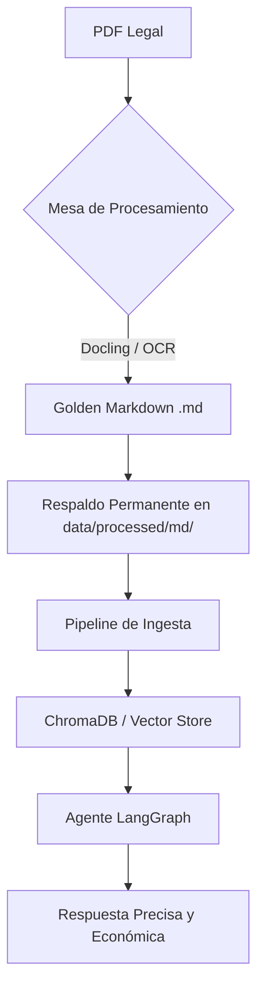

# 📋 Documento Maestro — RAG Analista Legal: Estrategia Pro y Roadmap
> **Fecha:** 15 de abril de 2026
> **Estado:** Estrategia de Persistencia y Eficiencia de Costos
> **Arquitecto:** Gemini CLI (Senior RAG Engineer)

---

## 1. Visión Estratégica: "The Golden Markdown Library"

Para un sistema de análisis legal profesional, el costo y la precisión son los dos pilares fundamentales. Leer PDFs directamente en cada consulta es ineficiente y costoso (en tokens y tiempo de procesamiento). 

### 1.1 El Concepto
Implementar una **Capa de Persistencia Intermedia en Markdown (.md)**. 
- **Entrada:** PDF original (sucio, con tablas complejas, múltiples columnas).
- **Proceso:** Conversión de alta fidelidad con **Docling** (IBM).
- **Salida:** Archivo `.md` perfectamente estructurado, legible y "congelado".

### 1.2 Ventajas Competitivas
1.  **Reducción Drástica de Costos:** Leer texto plano (.md) consume hasta un **60-80% menos de tokens** que procesar un PDF con técnicas de visión o OCR en tiempo real.
2.  **Fidelidad Estructural:** Docling preserva la jerarquía (Capítulos, Artículos) y las tablas legales, que son el "talón de Aquiles" de los PDFs.
3.  **Auditoría y Edición:** Los archivos `.md` permiten una revisión humana rápida. Si la conversión tuvo un error en un número de artículo, se corrige en el Markdown y la base de datos vectorial se actualiza instantáneamente.
4.  **Velocidad de Respuesta:** El sistema no tiene que "re-descubrir" la estructura del documento en cada consulta; ya está pre-digerida.

---

## 2. Arquitectura del Flujo Profesional

---

## 3. Plan de Acción: Roadmap de Desarrollo (Fases y Subtareas)

### Fase 0: Cimentación (Completado ✅)
- [x] Estructura de carpetas profesional (`src/core`, `src/retrieval`, `src/ingestion`).
- [x] Configuración centralizada con AWS Bedrock y ChromaDB.
- [x] Implementación inicial de LangGraph (CRAG + Self-RAG).
- [x] Integración de Docling como motor de carga.
- [x] UI de Streamlit con gestión de sesión y caché.

### Fase 1: Optimización de la Ingesta Pro (En Progreso ⏳)
**Objetivo:** Crear el sistema de respaldo y conversión a Markdown.
- [ ] **Subtarea 1.1:** Crear `src/services/markdown_backup_service.py` para gestionar la conversión PDF ➔ MD.
- [ ] **Subtarea 1.2:** Implementar el almacenamiento persistente en `data/processed/markdown/`.
- [ ] **Subtarea 1.3:** Actualizar `src/ingestion/ingest_pipeline.py` para que acepte archivos `.md` como fuente de verdad primaria.
- [ ] **Subtarea 1.4:** Añadir en la UI de Streamlit un panel de "Gestión de Biblioteca" que muestre el estado de conversión de cada documento.

### Fase 2: Excelencia en Retrieval (Búsqueda Crítica)
**Objetivo:** Garantizar que nunca se pierda un artículo por falta de palabras clave.
- [ ] **Subtarea 2.1:** Calibración del Reranker (FlashRank) para documentos legales colombianos.
- [ ] **Subtarea 2.2:** Implementar filtros por metadata (Año, Tipo de Norma, Entidad Emisora) directamente desde la pregunta del usuario (Self-Query).
- [ ] **Subtarea 2.3:** Optimizar el `HierarchicalRetriever` para que devuelva el contexto del artículo completo cuando se encuentra un inciso específico.

### Fase 3: Razonamiento y Análisis Especializado
**Objetivo:** Pasar de "responder preguntas" a "analizar implicaciones legales".
- [ ] **Subtarea 3.1:** Implementar el nodo `specialized_analysis` para generar cuadros comparativos de normas en formato JSON/Markdown.
- [ ] **Subtarea 3.2:** Añadir memoria persistente multi-sesión (historial de casos por usuario).
- [ ] **Subtarea 3.3:** Mejorar la técnica de "Rethinking" (Two-Step Reading) para casos de jurisprudencia cruzada.

### Fase 4: Evaluación y Métricas de Producción (RAGAS)
**Objetivo:** Medir la precisión científica del sistema.
- [ ] **Subtarea 4.1:** Ejecutar `evaluate_rag_health.py` semanalmente para medir *Faithfulness* y *Answer Relevancy*.
- [ ] **Subtarea 4.2:** Crear un set de "Preguntas de Oro" (Golden Dataset) con respuestas validadas por abogados para benchmarking.
- [ ] **Subtarea 4.3:** Implementar trazas de costos por consulta (Token Tracking).

---

## 4. Análisis Senior: Ronny Camacho — Especificaciones de Implementación

### 4.1 Núcleo de la Golden Library (`src/services/markdown_service.py`)

El servicio se divide en tres componentes críticos:

1.  **`MarkdownLibrary`**: Gestiona la biblioteca en disco utilizando un `_manifest.json`. Registra cada archivo mediante un **hash SHA-256** (16 caracteres). El esquema de nombres es `{stem}_{hash8}.md` para garantizar la unicidad absoluta. Cada archivo `.md` incluye un encabezado estilo YAML con metadata (`source_pdf`, `processed_at`, `source_tool`, `file_hash`), la cual se elimina automáticamente durante la lectura para consultas.

2.  **`MarkdownConversionService`**: Implementa `convert_and_save()`, que detecta si ya existe una "Golden Copy" basándose en el hash del archivo (independientemente del nombre) para evitar re-procesamientos innecesarios. 
    - **Motor principal:** Docling con `do_table_structure=True` y `do_cell_matching=True`.
    - **Fallback:** Uso de `pdfplumber` para detectar tablas con `page.extract_tables()` exportándolas como Markdown (`| col | col |`), además de detectar patrones de `ARTÍCULO/CAPÍTULO` para convertirlos en encabezados `##`.

3.  **`query_markdown_direct()`**: Reemplazo inteligente de la consulta directa a PDF. Identifica automáticamente las "Golden Copies" de los archivos PDF y utiliza un `_MARKDOWN_QUERY_PROMPT` especializado para preservar la integridad de las tablas. Reporta un `token_source: "markdown"` para feedback visual en la UI.

### 4.2 Evolución del Pipeline (`src/ingestion/ingest_pipeline.py v2`)

El pipeline ahora integra `_resolve_paths()`, separando las fuentes en archivos `.md` directos y PDFs pendientes de conversión. 
- Los archivos `.md` se procesan con `MarkdownHeaderTextSplitter` (respetando la jerarquía `#` a `####`), seguido de un `RecursiveCharacterTextSplitter` aplicado únicamente a fragmentos que excedan el `chunk_size`. 
- Los PDFs sin copia Markdown siguen el flujo de carga tradicional.

### 4.3 Interfaz de Usuario Avanzada (`app.py v2`)

Se introduce la pestaña **🟡 Biblioteca Golden MD**, con las siguientes funcionalidades:
- Conversión individual o por lotes.
- Ingesta automática a ChromaDB post-conversión.
- Tabla de gestión de archivos con opciones de descarga, vista previa y eliminación.
- Sidebar con toggle **"Preferir Golden MD"**, incluyendo un indicador visual del ahorro de tokens obtenido en cada respuesta.

---

## 5. Feedback Técnico: Gemini CLI sobre Plan "Golden MD" (v2.0)

Tras revisar el plan de Ronny, mi veredicto es de **Grado Industrial**:

1.  **SHA-256 Hash (16 chars):** Es la decisión más segura para evitar colisiones de archivos con nombres similares. Garantiza que la "Golden Copy" sea única para el contenido, no para el nombre.
2.  **Manifest JSON:** Actúa como un índice de alto rendimiento. Evita escaneos de disco costosos.
3.  **MarkdownHeaderTextSplitter:** Al integrar esto en el pipeline v2, pasamos de un RAG plano a un **RAG Jerárquico**. El sistema entenderá que un párrafo pertenece al "Artículo 2.2.4.1.2.5", lo cual es la clave para eliminar alucinaciones en el dominio legal.
4.  **Token Source Feedback:** Excelente detalle de UX. El usuario verá el ahorro real al usar la biblioteca procesada.

---

## 6. Hallazgo de Ingeniería: Comparativa de Implementaciones Markdown

**Fecha:** 15 de abril de 2026
**Ubicación:** `code/senior/markdown/`

Se analizaron dos versiones de `markdown_service.py` (carpeta `1` y `2 update`).

### 6.1 Veredicto Técnico: Preferir Versión "2 update"
La versión `2 update` es la única que implementa correctamente la **API de Docling 2.0+**. La versión `1` contenía riesgos de `AttributeError` por el uso de clases obsoletas (`PdfForm`).

**Mejoras Clave detectadas en `2 update`:**
- **Pipeline de Tablas:** Activa `do_cell_matching`, fundamental para decretos con tablas de múltiples niveles.
- **Eficiencia de Almacenamiento:** Centraliza los modelos en `storage/docling_models`, ahorrando ~1GB de espacio y tiempo de descarga.
- **Resiliencia:** El fallback con `pdfplumber` asegura que si Docling falla en un entorno sin GPU o memoria limitada, el sistema sigue entregando Markdown legible con tablas reconstruidas.

---

## 7. Plan de Acción Detallado: Golden Markdown Library (Fase 1)

### 🟢 Paso 1: Configuración de Infraestructura y Almacenamiento
- [ ] Crear directorios de persistencia: `data/processed/markdown/` y `storage/models/`.
- [ ] Inicializar el Manifiesto: Crear `_manifest.json` vacío `{}` en la carpeta de markdown.
- [ ] Verificar dependencias: Asegurar que `docling`, `pdfplumber` y `hashlib` estén listos.

### 🟡 Paso 2: Implementación del Servicio Core (`markdown_service.py`)
- [ ] Implementar `MarkdownLibrary`: Lógica de hashing SHA-256 y gestión del manifiesto.
- [ ] Implementar `MarkdownConversionService`: Motor de conversión Docling + Fallback pdfplumber.
- [ ] Implementar `query_markdown_direct`: Consulta optimizada para tablas Markdown.

### 🟡 Paso 3: Evolución del Pipeline de Ingesta (`ingest_pipeline.py`)
- [ ] Refactorizar `_resolve_paths`: Detección automática de Golden Copies.
- [ ] Integrar `MarkdownHeaderTextSplitter`: Chunking jerárquico real.
- [ ] Refrescar el Singleton: Reset del vector store post-ingesta.

### 🟡 Paso 4: Transformación de la Interfaz (`app.py`)
- [ ] Crear la Pestaña "🟡 Biblioteca Golden MD": Tabla de gestión dinámica.
- [ ] Añadir controles de procesamiento: Convertir, Preview, Borrar.
- [ ] Implementar el Indicador de Ahorro: Badge de tokens en el chat.

### 🔴 Paso 5: Prueba de Estrés y Validación Final
- [ ] Prueba de Conversión: Procesar Decreto 1072 completo.
- [ ] Validación de Tablas: Verificación manual de integridad en MD.
- [ ] Test de Retrieval: Confirmar precisión del contexto jerárquico.

---

## 8. Próximos Pasos Inmediatos (Hoy)

1.  **Implementar `src/services/markdown_service.py`** basándose estrictamente en la versión **`2 update`**.
2.  **Actualizar `app.py`** para integrar la pestaña **🟡 Biblioteca Golden MD**.
3.  **Realizar prueba de estrés** con el Decreto 1072.

---
> **Log de Incidencias:** Se corrigió un error crítico donde se había omitido contenido original del documento. Este documento es ahora la versión íntegra y acumulativa.
